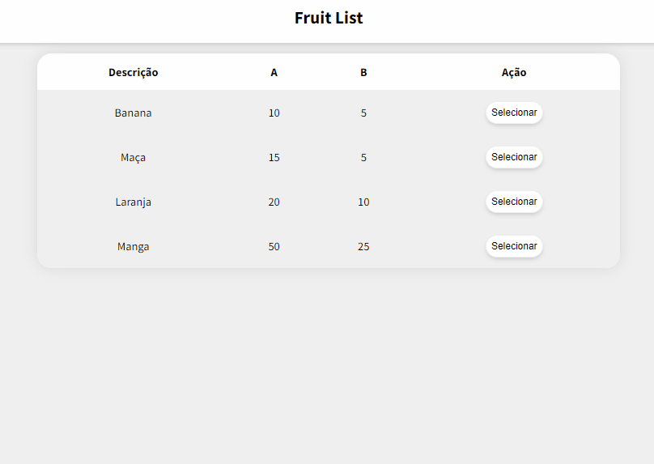

# Fruit List
<h1 align="center">
    
</h1>

# Descrião
Projeto realizado em React, consumindo uma API em C#/.NET desenvolvida para o fim deste projeto. O mesmo consiste em consumir uma API, realizar operações que contenham roteamento, variáveis reativas e componentização.

# Construído com
 - **React - React** é uma biblioteca front-end JavaScript de código aberto com foco em criar interfaces de usuário em páginas web.

## Status do Projeto
**Concluído:** O projeto se encontra finalizado.

## Autor
- **Desenvolvimento: Leonardo Borges** - Responsável pelo desenvolvimento da aplicação;
